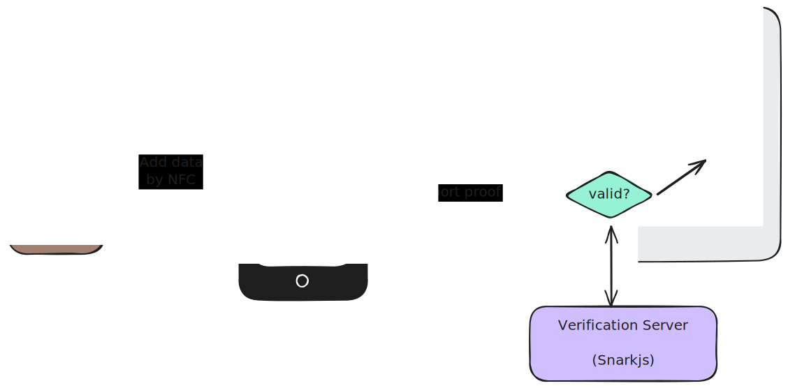

# Dog18

[On the internet nobody knows you're dog](https://en.wikipedia.org/wiki/On_the_Internet,_nobody_knows_you're_a_dog), but we'll make sure you're 18.\
Built with [openpassport](https://openpassport.app).

## Getting Started

### Prerequisites

- [bun](https://bun.sh/docs/installation)
- Mobile device that supports near-field communication (NFC).
- Proof of Passport app installed on mobile device: [iOS](https://apps.apple.com/us/app/proof-of-passport/id6478563710), [Android](https://play.google.com/store/apps/details?id=com.proofofpassportapp).
- A biometric passport (aka e-passport).

1. On mobile app:
   1. Open proof of passport app on your mobile device.
   2. Scan your passport (_Open Camera_) OR _use mock passport data > Generate passport data > Next_.
2. On desktop:
   1. Install deps: `bun i`.
   2. Start local web client and verification server: `bun dev`.
   3. Open local wep client: [`localhost:5173`](http://localhost:5173).
3. On mobile app
   1. Scan QR Code shown in desktop's browser.
   2. Tap _verify_.
4. In the web client, you should be automatically be redirected to the protected page.

## What is going on?

1. With the OpenPassport mobile app, the passport electronic data is transferred to the mobile device by near field communication.
2. With [`@openpassport/sdk`](https://github.com/zk-passport/openpassport/tree/main/sdk), one can generate a QR code in the web client to request the generation of a specific proof (particular set of requirements).
3. Upon scanning this QR code, a web socket connection is opened between the mobile device and the web client.
4. The user initiates the generation of the proof on the mobile device.
5. The mobile device transfers this proof to the web client.
6. The web client can now perform a verification ([`@openpassport/sdk`](https://github.com/zk-passport/openpassport) < [`snarkjs`](https://github.com/iden3/snarkjs)) of this proof or transfer this proof for an authentication server to verify it.
7. Depending on the verification result, the web client can authorize access to some restricted content.

## How it was built

### Reused as is

- circuits from openpassport: circom/snarkjs
- openpassport mobile app

### Reused and modified

- `@openpassport/sdk`
  - I had issues with the packaging of this upstream dependency: it was mixing different targets and would lead to issues (e.g react stuff being imported server side). So in the [verification server](./server), I more or less copy pasted the original code into (see [`lib/vendor`](./server/src/lib/vendor)), cutting out the part not needed server side (react components etc...)
  - I refactored a bit the original [`OpenPassport1StepQRcode`](./client/src/components/OpenPassportQRCode) to skip the verification client side, as I wanted to perform it server side (avoiding doing it twice), and to split it in different sub components and hooks.

### Implemented from scratch

- web client: react, tailwindcss
- verification server: express
